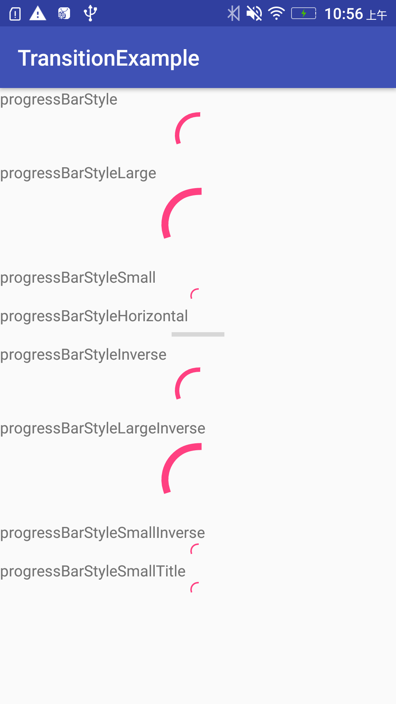

###  ContentLoadingProgressBar
##### Style
'''

        <!-- Default ProgressBar style. This is a medium circular progress bar. -->
        <attr name="progressBarStyle" format="reference" />
        <!-- Horizontal ProgressBar style. This is a horizontal progress bar. -->
        <attr name="progressBarStyleHorizontal" format="reference" />
        <!-- Small ProgressBar style. This is a small circular progress bar. -->
        <attr name="progressBarStyleSmall" format="reference" />
        <!-- Small ProgressBar in title style. This is a small circular progress bar that will be placed in title bars. -->
        <attr name="progressBarStyleSmallTitle" format="reference" />
        <!-- Large ProgressBar style. This is a large circular progress bar. -->
        <attr name="progressBarStyleLarge" format="reference" />
        <!-- Inverse ProgressBar style. This is a medium circular progress bar. -->
        <attr name="progressBarStyleInverse" format="reference" />
        <!-- Small inverse ProgressBar style. This is a small circular progress bar. -->
        <attr name="progressBarStyleSmallInverse" format="reference" />
        <!-- Large inverse ProgressBar style. This is a large circular progress bar. -->
        <attr name="progressBarStyleLargeInverse" format="reference" />
             
'''        

##### Layout
'''

    <android.support.v4.widget.ContentLoadingProgressBar
                style="?android:attr/progressBarStyle"
                android:layout_width="wrap_content"
                android:layout_height="wrap_content"
                android:layout_gravity="center_horizontal" />

'''
##### Image

